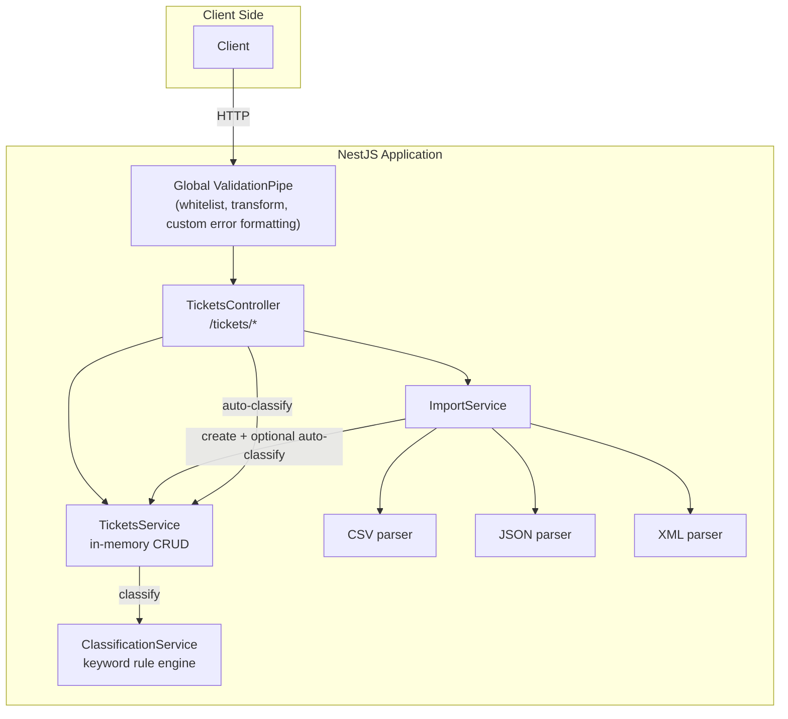
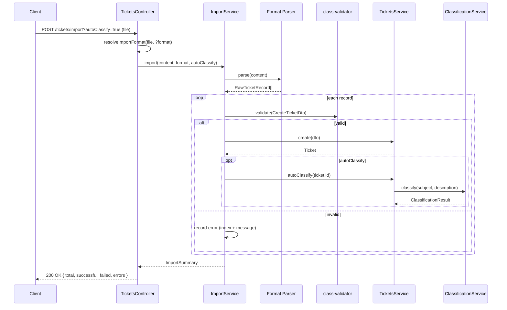

# Architecture

## High-Level Architecture

## Component Descriptions

| Component | Responsibility |
|---|---|
| `TicketsController` | All 7 HTTP endpoints under `/tickets`. Thin — delegates to services, only owns HTTP-shape concerns (file upload handling, format inference from filename/mimetype). |
| `TicketsService` | Single source of truth for ticket state (an in-memory array, per spec — no database). CRUD + the `autoClassify(id)` orchestration that calls into `ClassificationService` and writes the result back onto the ticket. |
| `ImportService` | Format-agnostic pipeline: parse → map to `CreateTicketDto` → `class-validator` validate → create-or-record-error. Produces the `{ total, successful, failed, errors }` summary required by the spec. Doesn't know anything about CSV/JSON/XML syntax itself — that's delegated to the parsers. |
| `csv.parser.ts` / `json.parser.ts` / `xml.parser.ts` | Each converts one file format into the same intermediate `RawTicketRecord[]` shape. Isolating format-specific logic here means `ImportService` and the validation/creation pipeline are format-agnostic, and adding a 4th format later would only mean adding one more parser + one line in `ImportService.parse()`. |
| `ClassificationService` | A deterministic, keyword-table-driven rule engine (see [Design Decisions](#design-decisions) for why it isn't an LLM call). Pure function of `(subject, description) -> ClassificationResult` — no side effects, which is what makes it trivial to unit test (`tests/categorization.spec.ts`, 10+ cases). |

## Data Flow: Bulk Import with Auto-Classification

## Design Decisions

- **In-memory storage, per spec.** No database. `TicketsService` holds a single `Ticket[]` array.
  This is intentional for a homework-scoped API (no persistence requirement, no concurrent-process
  fan-out) — the trade-off is that state resets on every restart and doesn't survive multiple
  instances, which would matter the moment this needed to run behind a load balancer or survive
  a redeploy.
- **Deterministic, keyword-based classification instead of an LLM call.** The spec's priority/category
  rules are already expressed as keyword lists ("urgent: contains 'critical', 'production down'...").
  Implementing them as a literal keyword-matching table (`src/classification/keywords.ts`) rather
  than routing through an LLM keeps classification free, sub-millisecond, and — critically —
  100% deterministic, so `tests/categorization.spec.ts` can assert exact outputs instead of fuzzy
  LLM-judge comparisons. The trade-off is that it can't generalize beyond the listed keywords (a
  ticket that says "the app won't open" without the word "crash"/"error" falls back to `other`) —
  a follow-up LLM-based fallback classifier for the `other`/low-confidence cases would be the
  natural next iteration.
- **Format parsers share one intermediate shape (`RawTicketRecord`).** Rather than each parser
  producing its own `CreateTicketDto`, they all produce the same loosely-typed intermediate record,
  and `ImportService` owns the one place that maps + validates against `CreateTicketDto`. This
  means validation rules (and any future change to them) live in exactly one place regardless of
  which file format triggered the import.
- **`main.ts` exports a `createApp()` factory** used by both `bootstrap()` (real server) and every
  e2e/integration/performance test (`tests/*.spec.ts` that use `supertest`). This avoids duplicating
  the global `ValidationPipe` + error-formatting setup between production and test code, which is a
  common source of "tests pass but prod behaves differently" bugs.
- **Bulk import never aborts on the first bad row.** Each record is validated and created
  independently; a malformed *row* becomes an entry in `errors` rather than failing the whole
  request. Only a file that fails to *parse* at all (bad CSV/JSON/XML syntax) returns `400` for the
  whole request, since there's no partial result to report in that case.

## Security Considerations

- Global `ValidationPipe` runs with `whitelist: true` + `forbidNonWhitelisted: true`, so unexpected
  body fields are rejected outright rather than silently accepted (reduces mass-assignment risk).
- File uploads are read into memory (`multer`'s default in-memory storage) and never written to
  disk, so there's no path-traversal or arbitrary-file-write surface from the import endpoint.
- **Known accepted risk:** `@nestjs/platform-express`'s bundled `multer` version has two open
  high-severity advisories (deeply-nested-field-name DoS, incomplete cleanup on aborted uploads —
  see `npm audit`). The only available fix downgrades `@nestjs/core`/`@nestjs/testing` to the 7.x
  line, which is a much larger regression than the risk it avoids for a homework-scoped, non-public
  service. Documented here rather than silently ignored.
- No authentication/authorization layer — out of scope per the spec, but would be the first thing
  to add before this ran anywhere beyond local grading (every endpoint is currently unauthenticated).

## Performance Considerations

- All in-memory operations (`findAll`, `findOne`, filtering) are O(n) linear scans over the ticket
  array — fine at the scale a homework grader will exercise (hundreds of tickets;
  `tests/performance.spec.ts` benchmarks 500 tickets filtering in <200ms), but would need an index
  (e.g. a `Map` keyed by id, secondary indexes per filter field) before this could scale to a real
  ticket volume.
- Classification is a handful of `String.includes()` scans over a lowercased string per ticket —
  effectively free (200 classifications in <500ms in the benchmark suite).
- Bulk import validates and creates records sequentially in a `for...of` loop rather than
  `Promise.all`, so import time scales linearly with file size — acceptable for the 50-row sample
  file (imports in <1s), but a very large file (tens of thousands of rows) would benefit from
  batching.

## AI Model Note

This document (`ARCHITECTURE.md`) was drafted by Claude Code (Sonnet 5) alongside the rest of the
implementation in the same session, then reviewed/regenerated with a second model as required by
Task 4 ("use different AI models for different doc types"). *[Fill in: which model you used for
the second pass, and what — if anything — it changed, e.g. "Reviewed with Opus 4.8 via `/model`;
it suggested calling out the multer security trade-off explicitly, which is now in the Security
Considerations section above."]*
