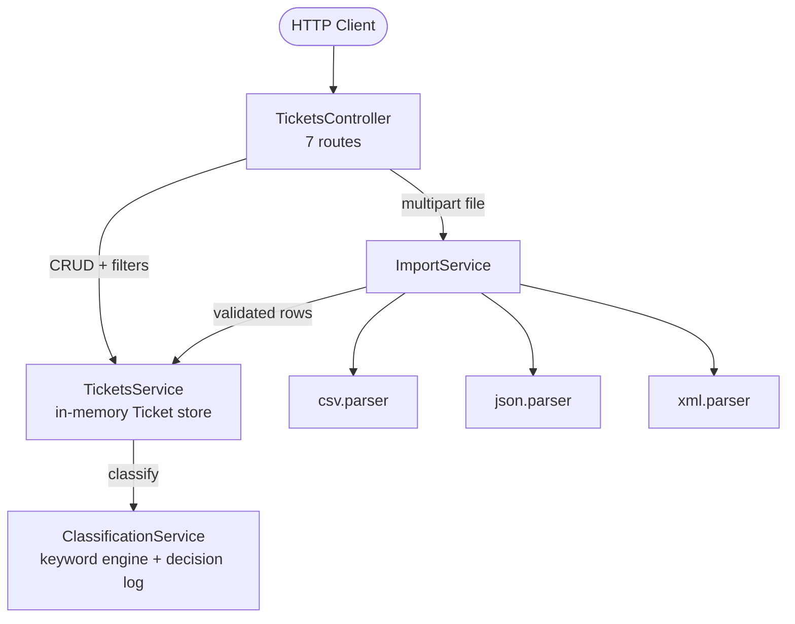

# 🎧 Homework 2: Intelligent Customer Support System

> **Student Name**: Mykhailo Gorishnyi
> **Date Submitted**: 2026-07-07
> **AI Tools Used**: Claude Code (Fable 5 orchestrator + Haiku / Sonnet / Opus subagents)

---

## 📋 Project Overview

A customer support ticket management REST API built with **NestJS 11 + TypeScript**. It imports tickets from **CSV, JSON and XML** files, automatically categorizes issues and assigns priorities with a deterministic keyword engine, and ships with a **56-test TDD suite** (>85% coverage enforced by Jest) and multi-level documentation.

### Features

- **CRUD API** for support tickets with filtering by category, priority, status, customer and assignee
- **Bulk import** from CSV / JSON / XML (multipart upload) with per-row validation — one bad row never aborts the batch; the summary reports `total / successful / failed` with per-row error details
- **Auto-classification**: keyword-based category + priority assignment with confidence score, human-readable reasoning, matched keywords, decision log, and manual-override tracking
- **Validation everywhere**: the same `CreateTicketDto` guards both `POST /tickets` and every imported row (email format, string lengths, enums, nested metadata)
- **TDD-built**: all 56 tests were written before the implementation (red → green)

## 🏗️ Architecture



Deeper diagrams (component + sequence): [docs/ARCHITECTURE.md](docs/ARCHITECTURE.md).

## 🚀 Installation & Setup

```bash
cd homework-2
npm install
npm run build
npm run start:prod        # API on http://localhost:3000
```

Full guide incl. demo scripts and troubleshooting: [HOWTORUN.md](HOWTORUN.md).

## 🧪 Running Tests

```bash
npm test                  # 56 tests across 8 suites
npm run test:cov          # + coverage report (threshold: 85% on all metrics)
```

Current coverage: **statements 97% · branches 88.6% · functions 100% · lines 99.3%**. See [docs/TESTING_GUIDE.md](docs/TESTING_GUIDE.md).

## 📁 Project Structure

```
homework-2/
├── src/
│   ├── app.factory.ts        # createApp() + global ValidationPipe (shared by main & tests)
│   ├── tickets/              # controller (7 routes), service, DTOs, Ticket entity + enums
│   ├── classification/       # keyword tables, classification service, decision log
│   └── import/               # import service + csv/json/xml parsers
├── tests/                    # 8 spec files (56 tests) + fixtures (sample/invalid/malformed)
├── demo/                     # run.sh, sample-requests.http, sample-requests.sh
└── docs/                     # API_REFERENCE, ARCHITECTURE, TESTING_GUIDE + screenshots/
```

## 🤖 How AI Was Used (Context–Model–Prompt)

The project was built by a **Claude Code multi-agent pipeline** orchestrated from a single session. Different documents were generated by **different AI models** (Task 4 requirement):

| Artifact | Model | Role |
|----------|-------|------|
| Planning & exploration | Fable 5 (Explore + Plan agents) | repo recon, implementation design |
| 56-test suite (8 files) | Fable 5 (3 parallel test-writer agents) | tests written **before** implementation |
| Implementation (src/) | Fable 5 (main session) | red → green TDD |
| [docs/API_REFERENCE.md](docs/API_REFERENCE.md) | **Claude Haiku** | API consumer docs |
| [docs/TESTING_GUIDE.md](docs/TESTING_GUIDE.md) | **Claude Sonnet** | QA docs |
| [docs/ARCHITECTURE.md](docs/ARCHITECTURE.md) | **Claude Opus** | tech-lead docs |
| README.md + HOWTORUN.md | Fable 5 (main session) | developer docs |

Workflow: plan approval → skeleton stubs → fixtures → **red run (54 failed / 56)** → implementation → **green run (56/56)** → coverage gate → docs by model-diverse agents → automated code review. Screenshots of the red/green runs and coverage are in [docs/screenshots/](docs/screenshots/).

---

<div align="center">

*This project was completed as part of the AI-Assisted Development course.*

</div>
