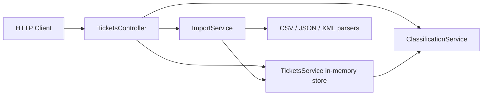

# 🎧 Homework 2: Intelligent Customer Support Ticket System

> **Student Name**: Mykhailo Gorishnyi
> **Date Submitted**: 2026-07-03
> **AI Tools Used**: Claude Code (Sonnet 5) — architecture, implementation, tests, README/API_REFERENCE/TESTING_GUIDE.
> ARCHITECTURE.md was drafted/reviewed with a second model — see [ARCHITECTURE.md](ARCHITECTURE.md#ai-model-note) for details.

---

## 📋 Project Overview

A customer support ticket management REST API built with **NestJS (Node.js + TypeScript)** and
**in-memory storage** (no database, per spec). It implements:

- Full ticket CRUD (`/tickets`)
- Bulk import from **CSV, JSON, and XML** files, with a per-record validation summary
- A deterministic, keyword-based **auto-classification** engine (category + priority + confidence + reasoning)
- A test suite of **66 automated tests** (56 required by the spec + 10 extra edge-case tests
  added while chasing coverage), all passing, with **>85% coverage on every metric**
  (statements, branches, functions, lines)

## 🏗️ Architecture (overview)



See [ARCHITECTURE.md](ARCHITECTURE.md) for the full component breakdown, sequence diagrams, and
design trade-offs.

## ✨ Features Implemented

### Task 1 — Multi-Format Ticket Import API ⭐
All 6 required endpoints (`POST/GET/PUT/DELETE /tickets`, `POST /tickets/import`), request
validation (email format, string lengths, enums), bulk import summary (`total/successful/failed`
with per-record error details), and graceful handling of malformed files (400, not 500).

### Task 2 — Auto-Classification ✅
`POST /tickets/:id/auto-classify` runs a deterministic keyword-based rule engine (no external AI
call — see [ARCHITECTURE.md](ARCHITECTURE.md#design-decisions) for why) that returns category,
priority, confidence (0–1), reasoning, and matched keywords. Optional `autoClassify: true` on
`POST /tickets` (and `?autoClassify=true` on `POST /tickets/import`) runs it immediately. Every
classification decision is logged via Nest's `Logger`. Manual override is just a normal
`PUT /tickets/:id` with a different `category`/`priority`.

### Task 3 — AI-Generated Test Suite ✅
See [TESTING_GUIDE.md](TESTING_GUIDE.md) for the full breakdown and how to run it.

### Task 4 — Multi-Level Documentation ✅
This README, [API_REFERENCE.md](API_REFERENCE.md), [ARCHITECTURE.md](ARCHITECTURE.md), and
[TESTING_GUIDE.md](TESTING_GUIDE.md).

### Task 5 — Integration & Performance Tests ✅
`tests/integration.spec.ts` covers the full lifecycle, bulk import + auto-classification, 20+
concurrent requests, and combined category+priority filtering. `tests/performance.spec.ts`
benchmarks creation, classification, filtering, import, and concurrent-request throughput.

---

## 🛠️ Installation & Setup

```bash
cd homework-2
npm install
npm run build      # compiles with the Nest CLI (tsc under the hood)
npm run start       # http://localhost:3000
# or, for local development with auto-reload:
npm run start:dev
```

No environment variables or external services are required — storage is in-memory and resets on
restart (by design, per the spec).

## 🧪 Running Tests

```bash
npm test            # run all 66 tests
npm run test:cov    # run with a coverage report (text summary + coverage/lcov-report/index.html)
```

See [TESTING_GUIDE.md](TESTING_GUIDE.md) for the full test breakdown, fixtures, and a manual
testing checklist.

## 📁 Project Structure

```
homework-2/
├── src/
│   ├── main.ts                     # bootstrap + global ValidationPipe + error formatting
│   ├── app.module.ts
│   ├── tickets/
│   │   ├── entities/ticket.entity.ts    # Ticket model + enums
│   │   ├── dto/                          # CreateTicketDto, UpdateTicketDto, QueryTicketsDto, TicketMetadataDto
│   │   ├── tickets.controller.ts         # all 7 HTTP endpoints
│   │   ├── tickets.service.ts            # in-memory CRUD + classification wiring
│   │   └── tickets.module.ts
│   ├── import/
│   │   ├── parsers/                      # csv.parser.ts, json.parser.ts, xml.parser.ts
│   │   ├── import.service.ts             # parse -> validate -> create, builds the bulk summary
│   │   └── import-summary.ts
│   └── classification/
│       ├── keywords.ts                   # category/priority keyword tables
│       └── classification.service.ts     # the rule engine
├── tests/
│   ├── ticket-api.spec.ts, ticket-model.spec.ts, import-csv.spec.ts, import-json.spec.ts,
│   │   import-xml.spec.ts, categorization.spec.ts, integration.spec.ts, performance.spec.ts
│   └── fixtures/                         # sample_tickets.{csv,json,xml} + invalid/malformed variants
├── demo/sample-data/                     # copies of the 3 sample_tickets.* deliverable files
├── docs/screenshots/                     # AI usage + test run screenshots (see PR)
├── README.md / API_REFERENCE.md / ARCHITECTURE.md / TESTING_GUIDE.md / HOWTORUN.md
```

## 🤖 How AI Was Used

- **Claude Code (Sonnet 5)** was used interactively for the full Context→Architecture→Implementation
  loop: reading the task spec, designing the module boundaries (tickets / import / classification),
  writing the DTOs and validation rules, the multi-format parsers, the rule-based classifier, the
  fixture generator script, and the 66-test suite.
- Design choices worth calling out that came from this process: keeping classification **fully
  deterministic** (no external LLM call) so it's fast, free, and 100%-testable; and reusing the
  same `createApp()` factory in `main.ts` for both production bootstrap and e2e tests, avoiding
  duplicated `ValidationPipe` setup.
- Everything generated was read, run, and iterated on — the first draft of the CSV/XML fixtures
  and the concurrency tests both needed manual fixes (a header/column mismatch in a hand-written
  CSV fixture, and a supertest lazy-listen race under concurrent requests) that were diagnosed by
  reading the actual test failures, not just re-prompting blindly.
- See [ARCHITECTURE.md](ARCHITECTURE.md#ai-model-note) for the second-model pass on that document.
