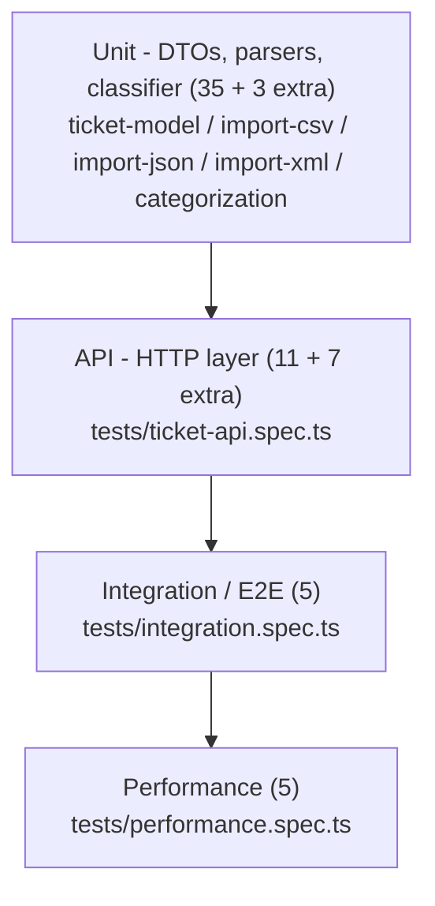

# Testing Guide

## Test Pyramid



The suite is 66 automated tests total: the 56 required by the spec (11 API, 9 model, 6 CSV,
5 JSON, 5 XML, 10 categorization, 5 integration, 5 performance) plus 10 extra edge-case tests
added while closing coverage gaps (unsupported import format, nested-metadata validation error
paths, missing-file upload, etc.) — every extra test targets a real behavior, not padding.

## How to Run

```bash
npm install
npm test            # run all tests once
npm run test:watch  # re-run on file changes
npm run test:cov     # run with coverage — prints the table below and writes coverage/lcov-report/index.html
```

Last measured coverage (`npm run test:cov`):

| Metric | Result |
|---|---|
| Statements | 94.95% |
| Branches | 87.66% |
| Functions | 98.11% |
| Lines | 97.89% |

All four metrics clear the required >85% overall bar. `src/main.ts`'s `bootstrap()` function (the
literal `app.listen(port)` + console.log at process entry) is the only meaningfully uncovered code —
it's exercised by actually running the server, not by the test suite, which is standard for an
entry-point function.

> 📸 A screenshot of this table (or `coverage/lcov-report/index.html` open in a browser) belongs at
> `docs/screenshots/test_coverage.png` per the assignment's deliverables.

## Test Files

| File | Covers |
|---|---|
| `tests/ticket-model.spec.ts` | `CreateTicketDto` validation rules (email, lengths, enums, nested metadata) |
| `tests/ticket-api.spec.ts` | Every `/tickets/*` HTTP endpoint, status codes, filtering, error shapes |
| `tests/import-csv.spec.ts` | CSV parsing, tag splitting, partial-failure summaries, malformed-file handling |
| `tests/import-json.spec.ts` | JSON parsing, nested structure passthrough, unsupported/malformed input |
| `tests/import-xml.spec.ts` | XML parsing, `<tag>` list handling, single-vs-array node normalization |
| `tests/categorization.spec.ts` | `ClassificationService` — every category/priority keyword path, confidence scoring |
| `tests/integration.spec.ts` | Full lifecycle, bulk import + auto-classify, 20+ concurrent requests, combined filters |
| `tests/performance.spec.ts` | Benchmarks — see table below |

## Sample Test Data

All fixtures live in `tests/fixtures/` (also copied to `demo/sample-data/` as the assignment's
standalone deliverable files):

- `sample_tickets.csv` — 50 valid tickets
- `sample_tickets.json` — 20 valid tickets
- `sample_tickets.xml` — 30 valid tickets
- `invalid_tickets.{csv,json,xml}` — 5 records each, 1 valid + 4 that fail DTO validation (bad
  email, empty name, too-short description, invalid enum) — used to test partial-failure summaries
- `malformed.{csv,json,xml}` — syntactically broken files (unterminated CSV quote, trailing-comma
  JSON, unclosed XML tag) — used to test the whole-request 400 path

## Manual Testing Checklist

- [ ] `npm run start` boots without errors on `http://localhost:3000`
- [ ] `POST /tickets` with a valid body returns `201` and a UUID `id`
- [ ] `POST /tickets` with an invalid email returns `400` with `details[].field === "customer_email"`
- [ ] `POST /tickets/import` with `sample_tickets.csv` returns `total: 50, successful: 50, failed: 0`
- [ ] `POST /tickets/import` with `invalid_tickets.json` returns `successful: 1, failed: 4` with 4 entries in `errors`
- [ ] `POST /tickets/import` with `malformed.xml` returns `400` (not `500`)
- [ ] `POST /tickets/:id/auto-classify` on a ticket whose description contains "critical" returns `priority: "urgent"`
- [ ] `PUT /tickets/:id` with `{"status": "resolved"}` sets a non-null `resolved_at`
- [ ] `GET /tickets?category=billing_question&priority=urgent` returns only tickets matching both filters
- [ ] `DELETE /tickets/:id` then `GET /tickets/:id` returns `404`

## Performance Benchmarks

Measured on a local dev machine — thresholds in the suite are deliberately generous (guard against
regressions, not micro-benchmark precision):

| Benchmark | Threshold | What it guards against |
|---|---|---|
| Create 100 tickets | < 2000ms | Accidental O(n²) in `create()` |
| Classify 200 texts | < 500ms | Regex/keyword-matching blowing up |
| Filter 500 tickets by category+priority | < 200ms | Unindexed scans becoming a bottleneck at moderate scale |
| Import `sample_tickets.csv` (50 rows) | < 1000ms | Per-row validation overhead |
| 20 concurrent `POST /tickets` | < 3000ms | Event-loop blocking under concurrent load |
