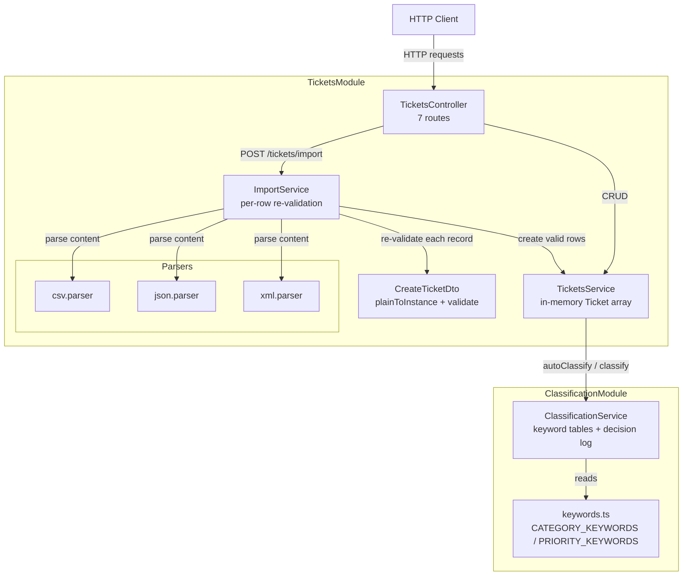

# Architecture — Customer Support API

The Customer Support API is a **NestJS 11 modular monolith** that manages support tickets. It stores everything in an **in-memory `Ticket[]` array** (no database), so all state resets on process restart. The application is organized around three concerns:

1. **Tickets CRUD** — create, read (with filtering), update, and delete support tickets over a REST interface.
2. **Multi-format import** — bulk-load tickets from uploaded CSV, JSON, or XML files, validating each row against the same DTO used by the single-create endpoint and returning a per-row success/failure summary.
3. **Keyword classification** — rule-based auto-categorization and priority assignment driven by ordered keyword tables, producing a confidence score, human-readable reasoning, matched keywords, and a decision log.

The codebase is split into two feature modules — `TicketsModule` (controllers, service, import) and `ClassificationModule` (classification service, exported for reuse) — wired together under a thin root `AppModule`. There is no persistence layer, no external service integration, and no authentication; the surface is intentionally small to fit the homework scope described in `TASKS.md`.

---

## 1. Component Diagram



Module boundaries: `TicketsModule` owns the HTTP surface, ticket storage, and the import pipeline; it imports `ClassificationModule`, which exports only `ClassificationService`. The parsers and `CreateTicketDto` live inside the tickets/import feature area, not in separate Nest modules — they are plain functions and a DTO class consumed by `ImportService`.

---

## 2. Component Descriptions

### 2.1 `app.factory.ts` — application bootstrap and error shape

`createApp()` builds the Nest application from `AppModule` and installs a single **global `ValidationPipe`** configured with:

- `whitelist: true` — strips properties not declared on the DTO.
- `forbidNonWhitelisted: true` — rejects payloads containing unknown properties.
- `transform: true` — coerces plain request bodies/queries into DTO class instances (also enables enum/type transformation for query params).
- `exceptionFactory: formatValidationErrors` — a custom formatter that flattens the class-validator error tree (including nested `metadata` errors) into a consistent shape:

```json
{ "error": "Validation failed", "details": [{ "field": "customer_email", "message": "..." }] }
```

`formatValidationErrors` walks children recursively and prefixes nested field paths (e.g. `metadata.source`). `main.ts` and the test suite both call `createApp()`, so tests exercise the exact same pipe and error contract as production.

### 2.2 `TicketsController` — HTTP surface (7 routes)

All routes are mounted under `@Controller('tickets')`:

| Method | Path | Handler | Success status |
| --- | --- | --- | --- |
| `POST` | `/tickets` | `create` | `201 Created` |
| `POST` | `/tickets/import` | `importTickets` | `200 OK` |
| `GET` | `/tickets` | `findAll` | `200 OK` |
| `GET` | `/tickets/:id` | `findOne` | `200 OK` |
| `PUT` | `/tickets/:id` | `update` | `200 OK` |
| `DELETE` | `/tickets/:id` | `remove` | `204 No Content` |
| `POST` | `/tickets/:id/auto-classify` | `autoClassify` | `200 OK` |

**Route ordering note:** the static `@Post('import')` route is declared **before** the parameterized `:id` routes. This matters because NestJS/Express resolve routes in declaration order; keeping `import` ahead of `:id`-style handlers avoids the literal segment being captured as an `:id` parameter.

The controller also owns two helpers:

- `isTruthyFlag(value)` — treats the `?autoClassify` query string as truthy only for `"true"` or `"1"`.
- `resolveImportFormat(file, explicitFormat)` — resolves the import format via a **priority chain**: explicit `?format` query param → file extension → MIME-type substring (`json` / `xml` / `csv`) → otherwise throws `400 BadRequest` with guidance to supply `?format=csv|json|xml`.

`importTickets` throws `400` when no file is uploaded under the `file` field, then delegates to `ImportService.import` with the decoded UTF-8 buffer.

### 2.3 `TicketsService` — in-memory store and business logic

Holds `private readonly tickets: Ticket[]` — the single source of truth. Key behaviors:

- **`create(dto)`** — mints a `randomUUID()`, applies defaults (`category` → `other`, `priority` → `medium`, `status` → `new`, `tags` → `[]`, nullable fields → `null`), stamps `created_at`/`updated_at`, normalizes metadata via `toMetadata`, and pushes to the array. If `dto.autoClassify` is set, it calls `autoClassify` immediately after insertion.
- **`findAll(query)`** — linear `Array.filter` over `category`, `priority`, `status`, `customer_id`, `assigned_to`, and `tag` (tag matched with `tags.includes`). Absent filters are skipped; multiple filters combine with AND.
- **`findOne(id)`** — linear lookup; throws `NotFoundException` (`404`) if absent.
- **`update(id, dto)`** — partial update; only `!== undefined` fields are applied. Setting `status` to `resolved` stamps `resolved_at`, otherwise clears it. **Manual-override detection:** if the ticket already has a `classification` and the update changes `category` or `priority` to a value different from the classified one, it sets `classification.manual_override = true`. Always refreshes `updated_at`.
- **`remove(id)`** — `findIndex` + `splice`; throws `404` if not found.
- **`autoClassify(id)`** — looks up the ticket, calls `ClassificationService.classify` with its subject + description, then **mutates** the ticket's `category`, `priority`, and `classification`, and refreshes `updated_at`.

### 2.4 `ImportService` — bulk-import orchestration

Injected with `TicketsService`. `import(content, format, autoClassify)` is `async` because per-row validation uses class-validator's async `validate()`:

1. Rejects unsupported `format` values with `400`.
2. Dispatches to the correct parser via `parse()`; a parser-thrown `ImportParseError` is translated to `400 BadRequest`, while unexpected errors propagate.
3. Iterates records, building a `CreateTicketDto` per row with `plainToInstance`, normalizing empty strings to `undefined` and defaulting `tags`/nested `metadata` fields.
4. Runs `validate(dto)` per row. **Row failures do not abort the batch** — the error message (collected from the whole error tree, including nested metadata) is appended to `summary.errors` with its `index`, and the loop continues.
5. Valid rows are created via `TicketsService.create`; if `autoClassify` was requested, each new ticket is classified.
6. Returns an `ImportSummary` (`total`, `successful`, `failed`, `ticketIds`, `errors`) and logs the outcome via `Logger`.

### 2.5 Parsers — `csv.parser` / `json.parser` / `xml.parser`

Each parser is a pure function returning `RawTicketRecord[]` and throwing `ImportParseError` on malformed input:

- **`parseCsvTickets`** — uses `csv-parse/sync` with `columns: true`, `skip_empty_lines`, `trim`. Flat `metadata_*` columns are folded into a nested `metadata` object; `tags` is a `|`-delimited string split into an array.
- **`parseJsonTickets`** — `JSON.parse`; requires a **top-level array** (otherwise `ImportParseError`). Maps each element defensively with optional chaining; non-array `tags` become `[]`.
- **`parseXmlTickets`** — validates via `fast-xml-parser`'s `XMLValidator`, then parses with attributes ignored and values untrimmed-as-typed. Requires a `<tickets>` root containing `<ticket>` children (single child normalized to an array via `ensureArray`); empty elements are coerced to `undefined` by the `text()` helper.

All three normalize to the shared `RawTicketRecord` shape so `ImportService` can treat every format uniformly downstream.

### 2.6 `ClassificationService` — rule-based classification

Injected into `TicketsService` via `ClassificationModule`. `classify(ticketId, subject, description)`:

1. Concatenates and lowercases `subject + description`.
2. Scans `CATEGORY_KEYWORDS` **in order** using pre-compiled word-boundary regexes (so `bug` never matches inside `debug`); the first table entry with ≥1 matching keyword wins. Likewise for `PRIORITY_KEYWORDS`.
3. Falls back to `category = other` / `priority = medium` when nothing matches.
4. Computes confidence:
   - **Category confidence** = `categoryMatched ? min(0.95, 0.5 + 0.15 * hits) : 0.3`
   - **Priority confidence** = `priorityMatched ? 0.9 : 0.5`
   - **Final confidence** = `round2((categoryConfidence + priorityConfidence) / 2)` — the average of the two, rounded to 2 decimal places (with an `EPSILON` correction).
5. Builds a human-readable `reasoning` string naming the matched keywords (or the default fallback) for both dimensions, and collects all matched `keywords`.
6. Returns a `ClassificationResult` (`category`, `priority`, `confidence`, `reasoning`, `keywords`, `classified_at`, `manual_override: false`), appends a `ClassificationDecision` (result + `ticket_id`) to an in-memory **decision log**, and emits a `Logger.log` line.

`getDecisions()` exposes the accumulated decision log. The **ordered keyword tables** in `keywords.ts` deliberately place `bug_report` (reproduction-oriented terms) ahead of `technical_issue` (generic "bug/error/crash") so the more specific category takes precedence.

---

## 3. Data Flow — Bulk Import

```mermaid
sequenceDiagram
    participant Client
    participant Controller as TicketsController
    participant Import as ImportService
    participant Parser as csv/json/xml parser
    participant DTO as CreateTicketDto (validate)
    participant Tickets as TicketsService
    participant Class as ClassificationService

    Client->>Controller: POST /tickets/import (multipart file, ?format, ?autoClassify)
    alt no file
        Controller-->>Client: 400 "file field required"
    end
    Controller->>Controller: resolveImportFormat(query → extension → mimetype)
    alt format undeterminable
        Controller-->>Client: 400 "provide ?format=csv|json|xml"
    end
    Controller->>Import: import(content, format, autoClassify)
    alt unsupported format
        Import-->>Client: 400 unsupported format
    end
    Import->>Parser: parse(content)
    alt malformed file
        Parser-->>Import: throw ImportParseError
        Import-->>Client: 400 malformed file message
    end
    Parser-->>Import: RawTicketRecord[]
    loop each record (index)
        Import->>DTO: plainToInstance + validate(dto)
        alt validation errors
            DTO-->>Import: errors
            Import->>Import: summary.errors.push({index, message}); failed++
        else valid
            Import->>Tickets: create(dto)
            Tickets-->>Import: ticket
            opt autoClassify
                Import->>Tickets: autoClassify(ticket.id)
                Tickets->>Class: classify(...)
            end
            Import->>Import: successful++; ticketIds.push
        end
    end
    Import-->>Client: 200 ImportSummary {total, successful, failed, ticketIds, errors}
```

The defining property of this flow is **partial success**: parse errors fail the whole request with `400`, but once parsing succeeds, individual row validation failures are collected rather than aborting the batch.

---

## 4. Data Flow — Auto-Classification & Manual Override

```mermaid
sequenceDiagram
    participant Client
    participant Controller as TicketsController
    participant Tickets as TicketsService
    participant Class as ClassificationService

    Note over Client,Class: Automatic path
    Client->>Controller: POST /tickets/:id/auto-classify
    Controller->>Tickets: autoClassify(id)
    Tickets->>Tickets: findOne(id) (404 if missing)
    Tickets->>Class: classify(id, subject, description)
    Class->>Class: match CATEGORY_KEYWORDS (ordered), PRIORITY_KEYWORDS (ordered)
    Class->>Class: confidence = round2((catConf + prioConf) / 2)
    Class->>Class: append to decision log + Logger.log
    Class-->>Tickets: ClassificationResult
    Tickets->>Tickets: mutate ticket.category / .priority / .classification / .updated_at
    Tickets-->>Controller: ticket
    Controller-->>Client: 200 ticket.classification

    Note over Client,Tickets: Manual override path
    Client->>Controller: PUT /tickets/:id { category|priority }
    Controller->>Tickets: update(id, dto)
    alt has classification AND category/priority differs from classified
        Tickets->>Tickets: classification.manual_override = true
    end
    Tickets->>Tickets: apply defined fields; refresh updated_at
    Tickets-->>Controller: ticket
    Controller-->>Client: 200 updated ticket
```

Note the two entry points that trigger classification: the explicit `POST /:id/auto-classify` route, and the `autoClassify` flag on `POST /tickets` / `POST /tickets/import`. The controller's auto-classify handler returns only `ticket.classification`, whereas the flag-driven paths return the full ticket. A subsequent `PUT` that changes `category`/`priority` away from the classified values flips `manual_override` to `true`.

---

## 5. Design Decisions & Trade-offs

- **In-memory array vs. database.** Storage is a plain `Ticket[]` inside `TicketsService`. This keeps the homework self-contained (no schema, migrations, or connection setup) and makes tests fast and deterministic. The obvious cost: all data is lost on restart, and there is no concurrency control or durability. Swapping in a repository would mean introducing a persistence abstraction behind `TicketsService`.
- **DTO re-use for per-row import validation.** `ImportService` runs the same `CreateTicketDto` (via `plainToInstance` + `validate`) that the single-create endpoint uses through the global pipe. This gives a **single source of truth** for validation rules and guarantees imported tickets meet the same contract as directly-created ones. Because validation runs per row, a single bad record fails only that row and is reported in the summary rather than aborting the whole batch.
- **Ordered keyword tables with `bug_report` before `technical_issue`.** Classification uses first-match-wins over ordered tables, so specificity is encoded by position: reproduction-oriented terms (`bug_report`) are checked before the broad `technical_issue` bucket. This is simple and predictable but means the tables must be manually curated to keep specific categories ahead of general ones.
- **Rule-based classification vs. ML.** The spec dictates concrete keywords and priority rules, so a deterministic keyword matcher is used instead of a model. It is fully **testable, explainable** (every decision ships `reasoning` + matched `keywords`), and has no training/inference dependency. The trade-off is limited generalization — it only recognizes the enumerated phrases and cannot infer intent beyond them.
- **Shared `createApp()` factory.** Both `main.ts` and the tests build the app through `createApp()`, so tests exercise the **real global `ValidationPipe`** and error-formatting behavior instead of a stubbed configuration. This eliminates drift between test and production request handling.
- **Separate `tsconfig.build.json`.** The build config extends the base `tsconfig.json` but excludes `tests` (and `node_modules`, `dist`), so test files never leak into the compiled `dist/` output shipped by the Nest build.

---

## 6. Security Considerations

- **Input validation.** The global `ValidationPipe` uses `whitelist` + `forbidNonWhitelisted`, so unknown properties are stripped/rejected and only declared, typed DTO fields ever reach the service layer. Enums, email format, and string-length bounds are enforced on both direct creates and imported rows.
- **File uploads held in memory.** `FileInterceptor` uses multer's default **memory storage**; the uploaded buffer is decoded to a UTF-8 string and parsed in-process. There is currently **no file-size limit** — a production deployment would need to cap upload size (and likely record count) to prevent memory exhaustion from large or malicious files.
- **No authentication/authorization.** All endpoints are open; this is out of scope for the homework. Production use would require auth (e.g. Nest guards / middleware) and per-resource authorization.
- **Minimal injection surface.** There is no database and no shell execution, so SQL/command-injection vectors are absent. Parsers (`csv-parse`, `fast-xml-parser`) are standard libraries invoked on in-memory strings; XML is validated before parsing, mitigating malformed-document issues.

---

## 7. Performance Considerations

- **Filtering is O(n).** `findAll` performs a linear scan of the in-memory array per request, and `findOne`/`remove` are linear lookups. At homework scale (hundreds of tickets) this is acceptable; at large scale it would warrant indexing or a database with query support.
- **Import is O(rows).** Parsing and per-row validation/creation scale linearly with record count. Validation is `async` per row, so throughput is bounded by class-validator cost per record.
- **Classification is O(keywords).** Each `classify` call scans the fixed keyword tables once over the concatenated subject/description text — effectively constant with respect to the ticket count.
- **Benchmarks.** `tests/test_performance.spec.ts` asserts concrete budgets against a live app on an ephemeral port: 100 sequential creates < 2000 ms, 200 sequential auto-classify calls < 1000 ms, a filtered `GET` among ~300 tickets < 500 ms, importing the 50-row sample CSV < 2000 ms, and 20 concurrent creates < 5000 ms.
