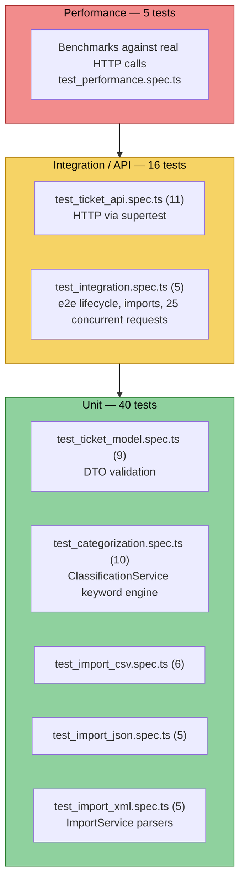

# Testing Guide — Customer Support API

This guide is for QA engineers verifying the **Customer Support API**, a NestJS 11 REST service for creating, classifying, and bulk-importing support tickets. It explains how the test suite is organized, how to run it, what each suite covers, and how to exercise the API by hand.

## Test philosophy

The project was built test-first (TDD, red → green → refactor): for every feature, a failing spec was written before the implementation that makes it pass. The suite is built with **Jest 29**, **ts-jest**, and **supertest**, and follows one guiding rule:

> **No mocking of the HTTP layer.** API-level and integration specs boot a real Nest application via `createApp()` (see `src/app.factory.ts`) and drive it end-to-end with `supertest`. Requests go through the actual global validation pipe, controllers, services, and in-memory store — the same code path a real client would hit. The only "unit" isolation used is instantiating individual services (`ClassificationService`, `TicketsService`, `ImportService`) directly, without HTTP, for fast, focused checks of business logic.

This means a green test suite is strong evidence the API actually works, not just that mocks were configured correctly.

## Test pyramid

The 56 tests are distributed across three levels: a broad base of fast unit tests, a middle layer of HTTP/API and integration tests, and a small cap of performance benchmarks.



The base (unit, ~40 tests) is the largest and fastest layer — DTO validation, the classification keyword engine, and the three import parsers (CSV/JSON/XML), all exercised directly against services with no network involved. The middle layer (16 tests) drives the real HTTP surface through `supertest`, including one true end-to-end suite that boots the app on a listening port and fires 25 concurrent requests. The top (5 tests) is a small set of timing benchmarks that guard against gross performance regressions.

## How to run the tests

All commands are run from the `homework-2` project root.

| Command | Purpose |
|---|---|
| `npm test` | Run the full suite once (all 8 spec files, 56 tests). |
| `npm run test:watch` | Run Jest in watch mode; re-runs affected tests on file save. Useful while fixing a failing test. |
| `npm run test:cov` | Run the full suite with coverage instrumentation and enforce the thresholds in `jest.config.js`. |
| `npx jest tests/test_categorization.spec.ts` | Run a single spec file. Substitute any file name from the inventory below. |
| `npx jest -t "auto-classify"` | Run only tests whose name matches a pattern (any spec file). |

After `npm run test:cov`, an HTML coverage report is written to:

```
coverage/lcov-report/index.html
```

Open it in a browser to drill into per-file, per-branch coverage. A machine-readable `coverage/lcov.info` is also produced for CI tooling.

**Coverage gate:** `jest.config.js` enforces a minimum of **85%** across branches, functions, lines, and statements (`coverageThreshold.global`). A `test:cov` run fails the process if any metric drops below its threshold, independent of whether individual tests pass. Current measured coverage on this codebase:

| Metric | Threshold | Actual |
|---|---|---|
| Statements | 85% | 97% |
| Branches | 85% | 88.6% |
| Functions | 85% | 100% |
| Lines | 85% | 99.3% |

## Test suite inventory

| Spec file | Level | Tests | What it covers |
|---|---|---|---|
| `test_ticket_api.spec.ts` | HTTP / API (supertest) | 11 | Full CRUD over `/tickets`: create with defaults, email/whitelist validation errors, auto-classify on create, list, filter by category/priority/status/assigned_to, get by id (incl. 404), update (incl. `resolved_at` on resolve, invalid enum rejection), delete (204 then 404), and the `/tickets/:id/auto-classify` endpoint including manual-override flagging. |
| `test_ticket_model.spec.ts` | Unit — DTO validation | 9 | `CreateTicketDto` validated the same way the app's global pipe does: valid payload passes; invalid email, subject/description length bounds, invalid `category`/`priority` enums, missing/invalid nested `metadata` (source, device_type), non-string `tags`, and payloads with optional fields omitted. |
| `test_import_csv.spec.ts` | Unit — import (CSV) | 6 | `ImportService` against CSV: imports all 50 rows of `sample_tickets.csv`, splits pipe-separated `tags`, reports per-row errors for `invalid_tickets.csv` while still importing the one valid row, rejects `malformed.csv` with `BadRequestException`, applies default category/priority when a row leaves them blank, and auto-classifies every row when requested. |
| `test_import_json.spec.ts` | Unit — import (JSON) | 5 | Same import contract as CSV but for JSON input: valid-file import, per-record error reporting, malformed-file rejection, defaulting, and auto-classify-on-import. |
| `test_import_xml.spec.ts` | Unit — import (XML) | 5 | Same import contract for XML input, covering the `fast-xml-parser`-backed path. |
| `test_categorization.spec.ts` | Unit — business logic | 10 | `ClassificationService` keyword engine: category detection (account_access, technical_issue, billing_question, feature_request, bug_report precedence over technical_issue, fallback to `other`), priority detection (urgent/high/low/medium keywords), confidence scoring bounds and scaling with match count, and reasoning/keyword reporting plus the decision log (`getDecisions()`). |
| `test_integration.spec.ts` | Integration / e2e | 5 | Full lifecycle (create → classify → progress → resolve → delete) against a listening server; importing the CSV sample with auto-classify applied to all rows; **25 concurrent** ticket creations with distinct ids; combined JSON + XML import with cross-format filtering; malformed file and missing-file rejection with meaningful 400 errors. |
| `test_performance.spec.ts` | Performance / benchmarks | 5 | Timing assertions described in the benchmarks table below. |

## Fixtures inventory (`tests/fixtures/`)

| File | Rows/records | Description |
|---|---|---|
| `sample_tickets.csv` | 50 | All valid. Tags are pipe-separated (e.g. `login\|password`). The first data row has empty `category` and `priority` columns to exercise default-value handling. |
| `sample_tickets.json` | 20 | All valid JSON records, covering the same field set as the CSV/XML samples. |
| `sample_tickets.xml` | 30 | All valid `<ticket>` elements under a `<tickets>` root, parsed via `fast-xml-parser`. |
| `invalid_tickets.csv` | 5 (4 invalid + 1 valid) | One row per validation failure: bad email, empty subject, too-short description, invalid category enum — plus one fully valid row to confirm partial-success reporting. |
| `invalid_tickets.json` | 4 (3 invalid + 1 valid) | Missing `customer_email`, too-short description, invalid `priority` enum — plus one valid record. |
| `invalid_tickets.xml` | 4 (3 invalid + 1 valid) | Same validation-failure shapes as the JSON/CSV invalid fixtures, in XML form. |
| `malformed.csv` | — | Structurally broken: an unclosed quoted field, which a strict CSV parser must fail on rather than silently misparse. |
| `malformed.json` | — | Truncated mid-array/mid-object; not valid JSON. |
| `malformed.xml` | — | Contains an unclosed `<ticket>` tag, making the document invalid XML. |

Malformed fixtures are used to assert `BadRequestException` / HTTP 400 with a non-empty error message, never a silent partial import or a 5xx crash.

## Performance benchmarks

| Benchmark | Threshold | Suite |
|---|---|---|
| 100 sequential ticket creates | < 2000 ms | `test_performance.spec.ts` |
| 200 sequential auto-classify calls on one ticket | < 1000 ms | `test_performance.spec.ts` |
| Filtered `GET /tickets` among ~300 stored tickets | < 500 ms | `test_performance.spec.ts` |
| Import of the 50-row `sample_tickets.csv` | < 2000 ms | `test_performance.spec.ts` |
| 20 concurrent ticket creates | < 5000 ms | `test_performance.spec.ts` |

These thresholds are **deliberately generous** so the suite stays green under CI noise (shared runners, cold caches, throttled CPUs) — they are regression guards against gross slowdowns (e.g. an accidental O(n²) scan), not tight SLA assertions. A local run will typically finish each benchmark well under its limit; treat repeated near-limit timings as a signal worth investigating even if the assertion still passes.

## Manual testing checklist

Use this checklist for exploratory / manual verification against a running instance (`npm run start:dev`), e.g. with `curl`, Postman, or Insomnia.

- [ ] Start the server (`npm run start:dev`) and confirm it boots without errors.
- [ ] `POST /tickets` with a valid payload returns `201` with a UUID `id`, `status: "new"`, `category: "other"`, `priority: "medium"`, `resolved_at: null`, and timestamps in ISO format.
- [ ] `POST /tickets` with an invalid `customer_email` (e.g. `"not-an-email"`) returns `400` with a validation error detail identifying the `customer_email` field.
- [ ] `POST /tickets/import` with a valid **CSV** file (`sample_tickets.csv`) returns `200` with `successful: 50`, `failed: 0`.
- [ ] `POST /tickets/import` with a valid **JSON** file (`sample_tickets.json`) returns `200` with `successful: 20`.
- [ ] `POST /tickets/import` with a valid **XML** file (`sample_tickets.xml`) returns `200` with `successful: 30`.
- [ ] `POST /tickets/import` with a malformed file (e.g. `malformed.csv`) returns `400` with a non-empty error message, not a crash.
- [ ] `POST /tickets/:id/auto-classify` on an existing ticket returns a category, priority, confidence (0–1), keywords, and reasoning.
- [ ] `GET /tickets?category=...&priority=...` returns only tickets matching both filters.
- [ ] `PUT /tickets/:id` with `{ "status": "resolved" }` sets `resolved_at` to a non-null ISO timestamp.
- [ ] `DELETE /tickets/:id` returns `204`, and a subsequent `GET /tickets/:id` on the same id returns `404`.
- [ ] `POST /tickets/import` with no file attached returns `400` mentioning the missing file.
