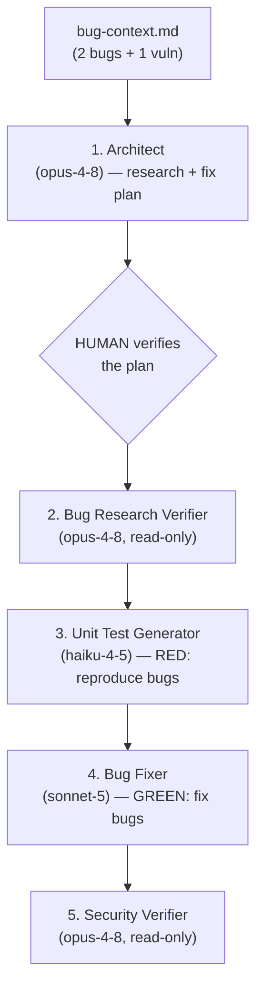

# Homework 4 — Architect-Led TDD Build Pipeline

**Author / Student**: Mykhailo Gorishnyi (`mgplaya`)
**Course**: GenAI and Agentic AI for Software Engineering
**Method**: Spec-Driven Development with [GitHub Spec Kit](https://github.com/github/spec-kit)

A **5-agent, research-first, test-driven** pipeline over a small Python app that
ships with **2 intentional bugs + 1 security vulnerability**. An **Architect**
researches the seeded bugs and plans the fixes; a **human verifies the plan**; then
the pipeline writes **failing TDD tests that reproduce the bugs (RED)** and the **Bug
Fixer** makes them pass (GREEN), finishing with a **security review**. Everything runs
from **one command** with a human gate in the middle. Each agent runs on a
**deliberately chosen model**.

---

## The pipeline



**Fixed order** (Constitution VII — *Research-First, then TDD*): research bugs →
**human verify** → verify research → failing tests reproduce bugs (RED) → fix
(GREEN) → security review.

### Workflow definition

The workflow is **declarative** in [`pipeline.yaml`](./pipeline.yaml) — the single
source of truth for the ordered stages, each stage's tool boundary, and the human
gate. [`run-pipeline.sh`](./run-pipeline.sh) is a thin engine that reads it (each
stage's **model** comes from its `agents/*.agent.md` frontmatter, and its **skills**
from that file's `skills:` list). Inspect it with `./run-pipeline.sh --list`.

## Run it

```bash
cd homework-4
python3.11 -m venv .venv && ./.venv/bin/pip install -r requirements.txt   # first time
./run-pipeline.sh                 # runs the Architect, then STOPS for your review
#   ... read context/bugs/001/research/codebase-research.md + implementation-plan.md ...
./run-pipeline.sh --continue      # verify research → RED tests → GREEN fix → security
python -m pytest                  # confirm the build is green
```

`run-pipeline.sh` invokes the Claude Code CLI headless (`claude -p`) once per agent,
**auto-loading each agent's skills** and granting each stage **only the tools its
role permits**. See [HOWTORUN.md](./HOWTORUN.md).

## The 5 agents & why each model

Each agent declares its model in its `agents/*.agent.md` frontmatter. Choices follow
Constitution Principle V — *Model-Appropriateness* (heavy where reasoning is
critical, cheap for mechanical work):

| # | Agent | Model | Why this model |
|---|-------|-------|----------------|
| 1 | **Architect** | `claude-opus-4-8` (heavy) | System design is the highest-leverage, most open-ended reasoning; a wrong interface propagates into tests and code. |
| 2 | **Bug Research Verifier** *(the required "Bug Research Verifier")* | `claude-opus-4-8` (heavy) | Approving an incomplete/inconsistent design is the costly failure mode; needs the strongest reasoning. |
| 3 | **Unit Test Generator** (TDD RED) | `claude-haiku-4-5-20251001` (**cheap**) | Turning a specified interface into assertions is mechanical → the cheapest model, per the "tests use light models" policy. |
| 4 | **Bug Fixer** *(the required "Bug Fixer")* (TDD GREEN) | `claude-sonnet-5` (mid) | Real algorithmic work, but bounded by a verified design and a fixed test suite → capable mid-tier. |
| 5 | **Security Verifier** | `claude-opus-4-8` (heavy) | Adversarial review where a missed vulnerability is expensive. |

> The four homework-required agents (Bug Research Verifier, Bug Fixer, Security
> Verifier, Unit Test Generator) are all present; the **Architect** is added, and the
> flow is reordered into research-first TDD (tests before implementation).

## The 4 skills (auto-loaded per agent)

| Skill | Used by | Purpose |
|-------|---------|---------|
| [`architecture-design.md`](./skills/architecture-design.md) | Architect | Bug-research + fix-plan sections + quality bar. |
| [`research-quality-measurement.md`](./skills/research-quality-measurement.md) | Bug Research Verifier | A/B/C/D quality levels + required `verified-research.md` sections. |
| [`unit-tests-FIRST.md`](./skills/unit-tests-FIRST.md) | Unit Test Generator | FIRST properties (Fast, Independent, Repeatable, Self-validating, Timely). |
| [`tdd-red-green.md`](./skills/tdd-red-green.md) | Test Generator + Bug Fixer | RED/GREEN discipline shared across the two TDD agents. |

## Enforced permission boundaries

`run-pipeline.sh` grants each stage only the tools it needs. Verifier stages get
`Read Glob Grep Write` (**no Edit, no Bash**), so they physically cannot mutate code
or run commands; the Architect gets no Bash; only the Bug Fixer and Test Generator
get `Edit Bash`. Constitution Principle II is a hard boundary, not a request.

## The sample app & its seeded bugs (Task 5)

A tiny `expense_splitter` (even split, weighted split, CLI amount parsing) ships with
three intentional defects, documented in
[bug-context.md](./context/bugs/001/bug-context.md):

| ID | Type | Location | Defect |
|----|------|----------|--------|
| **BUG-1** | Functional | `core.py` `split_even` | rounded shares don't sum back to the total (cents lost) |
| **BUG-2** | Functional | `core.py` `split_weighted` | divides by `len(weights)` instead of `sum(weights)` |
| **SEC-1** | Security (CRITICAL) | `cli.py` `parse_amount` | `eval()` on CLI input → arbitrary code execution |

The pipeline reproduces each with a failing test (RED) and fixes it (GREEN); after
the run `python -m pytest` is green and the CLI reconciles to the exact total and
rejects injected input.

## How Spec Kit was used

Built spec-first. Artifacts under [specs/001-tdd-build-pipeline/](./specs/001-tdd-build-pipeline/):
constitution (7 principles) → `spec.md` (3 user stories, 12 FRs) → `plan.md`
(Constitution Check passes) → research / data-model / contracts / quickstart →
`tasks.md`.

## Artifacts (under `context/bugs/001/`, matching the TASKS.md structure)

- `bug-context.md` — the build context (human seed input)
- `research/codebase-research.md` — Architect's bug research (file:line + root cause)
- `implementation-plan.md` — Architect's build plan + Build Sequence
- `research/verified-research.md` — Bug Research Verifier (quality level)
- `test-report.md` — RED evidence (failing tests written first)
- `fix-summary.md` — GREEN evidence (bugs fixed, tests pass)
- `security-report.md` — findings with severity/`file:line`/remediation
- `pipeline-run.log` — full transcript

## Repository layout

```
homework-4/
├── pipeline.yaml              # ← declarative workflow (stages, tools, gate)
├── run-pipeline.sh            # thin engine that reads pipeline.yaml (single command + gate)
├── agents/                    # 5 agent definitions (model in frontmatter)
├── skills/                    # architecture-design, research-quality, FIRST, tdd-red-green
├── context/bugs/001/         # bug context + all pipeline artifacts
├── src/expense_splitter/      # seeded buggy code → fixed by Bug Fixer
├── tests/                     # tests written first (RED → GREEN)
├── specs/001-tdd-build-pipeline/  # Spec Kit spec/plan/tasks/design
├── .specify/                  # Spec Kit infrastructure
├── docs/screenshots/          # evidence
└── HOWTORUN.md
```

## AI tools used

- **Claude Code (Opus 4.8)** orchestrated the build, driving the Spec Kit workflow.
- The **pipeline** runs Claude Opus 4.8 / Sonnet 5 / Haiku 4.5 via the `claude` CLI
  headless — real multi-agent execution, one model per role.
