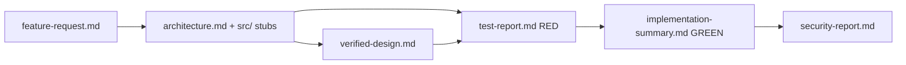

# Phase 1 Data Model: Artifacts & Entities

**Feature**: [spec.md](./spec.md) | **Date**: 2026-07-27

No database; the "data model" is the durable artifacts exchanged between agents plus
the target app's entities.

## Pipeline Artifacts (under `context/build/001/`)

| Artifact | Produced by | Consumed by | Required sections |
|----------|-------------|-------------|-------------------|
| `feature-request.md` | Human (seed) | Architect | goal, capabilities, non-functional, security, done |
| `architecture.md` | **Architect** | Design Verifier, Test Gen, Implementer | Overview; Public Interface; Behaviors & Invariants; Edge Cases; Security-Sensitive Requirements; Project Structure; Build Sequence; References |
| `verified-design.md` | **Design Verifier** | human gate, Test Gen | Verification Summary; Verified Claims; Discrepancies; Quality Assessment; References |
| `test-report.md` | **Unit Test Generator** | Implementer | Generated Tests; RED Run Outcome; FIRST Assessment; References |
| `implementation-summary.md` | **Implementer** | Security Verifier | Functions Implemented; Test Result (RED→GREEN); Overall Status; Manual Verification; References |
| `security-report.md` | **Security Verifier** | human | Scope; Security Requirement Check; Findings (severity/`file:line`/remediation); Summary |

Bold rows are the five agents' outputs.

## Target App Entities

- **Bill**: a `total` amount to divide.
- **EvenSplit**: dividing `total` among `n` so shares sum exactly to `total`.
- **WeightedSplit**: dividing `total` by weights, proportional to `sum(weights)`.
- **AmountInput**: an untrusted CLI string parsed safely (never executed).

## Invariants (testable — written as RED tests first)

- **INV-1**: `sum(split_evenly(total, n)) == total`.
- **INV-2**: `split_by_weights(total, w)[i] == total * w[i] / sum(w)`.
- **INV-3**: `parse_amount(s)` never executes `s`; non-numeric input raises a
  controlled error.

## Permission Boundaries

| Agent | May read | May write |
|-------|----------|-----------|
| Architect | feature-request | `architecture.md` + `src/**` stubs (no logic) |
| Design Verifier | design + stubs | `verified-design.md` only |
| Unit Test Generator | design + stubs | `tests/**` + `test-report.md` |
| Implementer | design + tests + stubs | `src/**` logic + `implementation-summary.md` |
| Security Verifier | implemented src + summary | `security-report.md` only |
