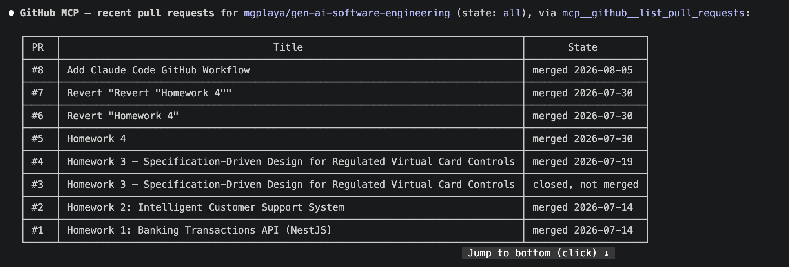
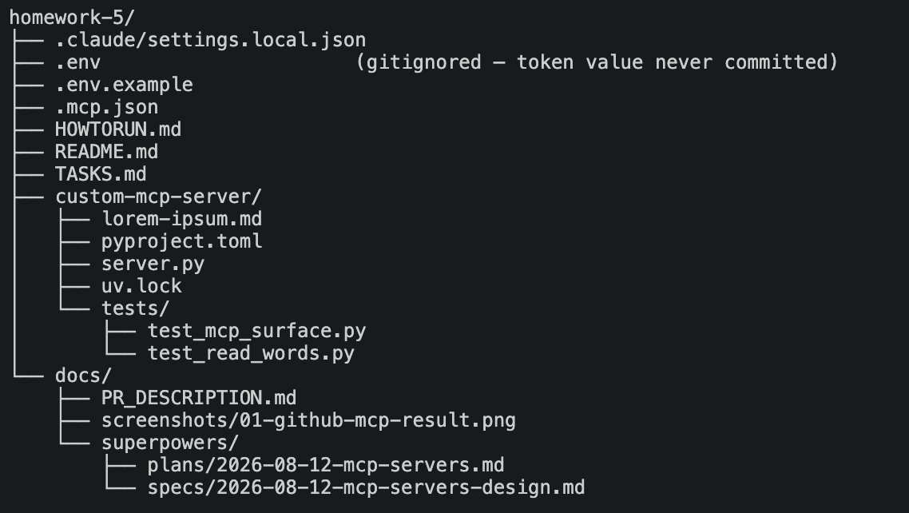
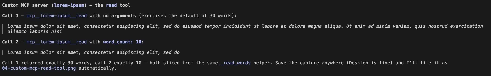

# Homework 5: MCP Servers

**Author:** Mykhailo Gorishnyi (`mgplaya`)
**Course:** GenAI and Agentic AI for Software Engineering

## Overview

This homework connects Claude Code to four Model Context Protocol (MCP) servers — three
external (GitHub, Filesystem, Atlassian/Jira) and one custom server built with
[FastMCP](https://gofastmcp.com) — and demonstrates a working interaction with each. The
custom server (`custom-mcp-server/`) exposes a lorem-ipsum text file as both an MCP resource
and an MCP tool, showing the two access patterns the protocol supports. All four servers are
registered in `.mcp.json` at the root of this homework so a grader can reproduce the setup by
launching Claude Code from `homework-5/`; see [`HOWTORUN.md`](HOWTORUN.md) for the exact steps.

## Servers

| Server | Transport | Endpoint / command | Auth | Demonstrated |
|---|---|---|---|---|
| `github` | http | `https://api.githubcopilot.com/mcp/` | Header: `Authorization: Bearer ${GITHUB_MCP_TOKEN}` (+ `X-MCP-Readonly: true`) | Listed recent pull requests on `mgplaya/gen-ai-software-engineering` |
| `filesystem` | stdio | `npx -y @modelcontextprotocol/server-filesystem ${HOME}/development/education/set/gen-ai-software-engineering` | none (path-scoped) | Summarized the `homework-5` project directory structure |
| `atlassian` | http | `https://mcp.atlassian.com/v1/mcp` | OAuth (via `/mcp` in Claude Code) | Retrieved the last 5 bugs from a real Jira project (read-only; keys masked, no screenshot) |
| `lorem-ipsum` | stdio | `uv --directory ${HOME}/development/education/set/gen-ai-software-engineering/homework-5/custom-mcp-server run server.py` | none | Called the `read` tool with the default and `word_count=10` |

**Note on `filesystem` scope:** the command line above asks for the course repository root,
but at runtime the server's allowed directory is just `homework-5`. Claude Code advertises
its working directory to each server as a client *root*, and recent versions of the
filesystem server prefer client-supplied roots over their command-line argument — so the
command-line path is a fallback for clients that do not send roots, and the effective
sandbox is whichever directory Claude Code was launched from. To scope it at the repository
root instead, launch from there with `claude --mcp-config homework-5/.mcp.json`. Details in
[`docs/mcp-transcripts.md`](docs/mcp-transcripts.md).

**Note on `github` auth:** the original design called for GitHub OAuth. GitHub's auth server
does not support Claude Code's dynamic client registration and fails with
`Incompatible auth server: does not support dynamic client registration`. Header-based
auth via `${GITHUB_MCP_TOKEN}` replaces it. `.mcp.json` stores only the variable name — no
token is committed. See [`HOWTORUN.md`](HOWTORUN.md) for how the variable is populated from
the existing `gh` CLI login.

**Read-only enforcement:** the `github` entry also sends `X-MCP-Readonly: true`. This
homework only reads from GitHub, and the header makes that a property of the connection
rather than a promise. With it, the server advertises 27 tools instead of 44 — every
write-capable tool (`create_pull_request`, `merge_pull_request`, `update_pull_request`, …)
is withheld, while `list_pull_requests` remains available.

## Resources vs. Tools

The assignment requires this distinction to be stated explicitly:

> **Resources** are URIs that Claude can read from (for example files or APIs). They are
> addressable and side-effect free.
> **Tools** are actions Claude can call to perform an operation (for example reading a file or
> running a command).

The custom server below shows both: the same underlying data is exposed as a resource (read by
URI) and as a tool (called with an argument).

## Custom MCP server

Location: `custom-mcp-server/`. Built with FastMCP (`fastmcp>=3.4.7`, declared in
`custom-mcp-server/pyproject.toml`). Source text: `custom-mcp-server/lorem-ipsum.md`, 272 words.

| Member | Kind | Signature | Behavior |
|---|---|---|---|
| `lorem://ipsum` | Resource | — | Returns the first 30 words of `lorem-ipsum.md` (the default slice) |
| `lorem://ipsum/{word_count}` | Resource template | `word_count: int` | Returns the first `word_count` words |
| `read` | Tool | `read(word_count: int = 30) -> str` | Same behavior as the resource template, callable as an action with a default argument |

All three delegate to one private helper, `_read_words(word_count)`, so the word-selection
logic exists in exactly one place. Edge behavior, verified by the automated test suite:

- `word_count < 1` raises `ValueError`.
- A `word_count` beyond the file's length clamps to the whole file (all 272 words) rather than
  erroring.
- A missing source file raises `FileNotFoundError` naming the expected path.

13 tests cover this surface (`uv run pytest` from `custom-mcp-server/`), including the MCP
registration itself, the default and explicit word counts, the clamp, the `ValueError` cases,
and that output always starts at the beginning of the source text.

## Screenshots

GitHub — recent pull requests on `mgplaya/gen-ai-software-engineering`:

Filesystem — the `homework-5` project directory structure:

Atlassian/Jira — **no screenshot, by choice.** This server was queried against a production
Jira containing customer and colleague data, and it returns full issue bodies (summaries,
descriptions, assignee email addresses) regardless of the fields the request asks for. Rather
than rely on a screen capture staying clean, the response is transcribed by hand with the
issue keys masked in
[`docs/mcp-transcripts.md`](docs/mcp-transcripts.md#3-jira-mcp-atlassian--last-5-bugs).
That transcript, the `atlassian` entry in `.mcp.json`, and its `✔ Connected` state in
`claude mcp list` are the evidence that the server was configured and working.

Custom server — the `read` tool, default and `word_count=10`:

